# AI 국내 여행 플래너 V2 서비스 기획서 (최종)

> 작성 기준일: 2026-09-30  
> 배포 사이트: <https://ai-travel-planner-three-chi.vercel.app/>  
> GitHub: <https://github.com/lgd12345/A1-3-ai_travel_planner>

## 1. 서비스 개요

TripAI는 사용자가 여행 날짜, 동행 유형, 선호 테마를 선택하면 AI와 실제 장소 검색 결과를 결합해 국내 여행지와 하루 일정을 추천하는 웹 서비스입니다. 여행지를 먼저 정하지 않은 사용자도 간단한 선택만으로 지역, 추천 이유, 관광지, 맛집, 시간대별 일정을 한 번에 확인할 수 있도록 기획했습니다.

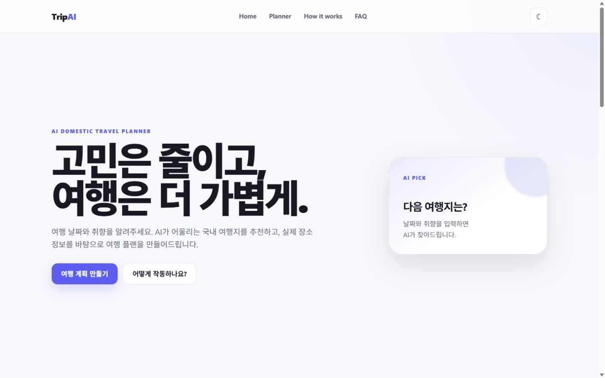

## 2. 기획 배경과 목표

기존 여행 검색은 지역을 먼저 정하고 관광지·음식점·동선을 각각 찾아야 하는 불편이 있습니다. 본 서비스는 이 과정을 한 화면의 입력과 한 번의 추천 요청으로 줄이는 것을 목표로 했습니다.

- 대상 사용자: 국내 당일 여행을 빠르게 계획하고 싶은 사용자
- 핵심 가치: 간단한 입력, 실제 장소 기반 추천, 자연스러운 일정 구성
- 결과 범위: 추천 지역, 추천 이유, 계절 팁, 관광지, 맛집, 하루 일정
- 사용 환경: 데스크톱과 모바일 웹

## 3. 사용자 입력

| 입력 | 방식 | 구현 내용 |
|---|---|---|
| 여행 날짜 | 날짜 선택 | 필수 입력이며 오늘부터 1년 이내 선택 |
| 동행 | 단일 선택 | 혼자·연인·친구·가족 중 선택, 같은 항목을 다시 누르면 해제 가능 |
| 여행 테마 | 복수 선택 | 힐링·자연·맛집·문화·액티비티·축제 |

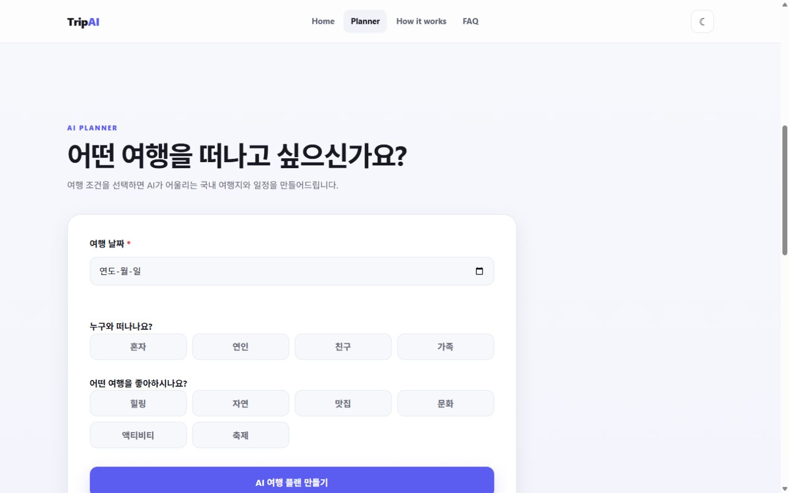

### 축제 테마 반영

초기 서비스 기획 초안에는 축제 테마가 빠져 있었으나, 현재 구현과 배포 사이트에는 축제가 포함되어 있습니다. 따라서 본 최종 기획서는 실제 구현을 기준으로 축제를 정식 테마로 반영했습니다.

축제를 선택하면 지역명과 축제 키워드로 후보를 검색하고, AI의 추천 이유에서 실제로 언급한 축제명과 일치하는 후보만 최대 2개까지 추천 장소에 포함합니다. 일치하는 축제를 찾지 못한 경우에는 일반 관광지로 구성을 채우며, 사용자에게 해당 조건에서 확인된 축제가 없다는 안내를 자연스럽게 표시합니다.

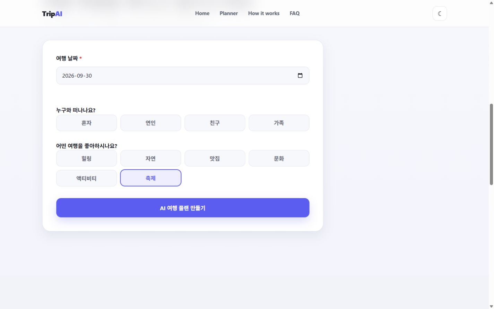

## 4. 화면 및 정보 구조

서비스는 한 페이지 안에서 다음 네 영역으로 구성됩니다.

1. **Home**: 서비스 핵심 메시지와 플래너 이동 버튼
2. **Planner**: 날짜·동행·테마 입력과 결과 출력
3. **How It Works**: 날짜 선택부터 일정 완성까지 4단계 안내
4. **FAQ**: AI 추천, 장소 정보, 서비스 이용 관련 안내

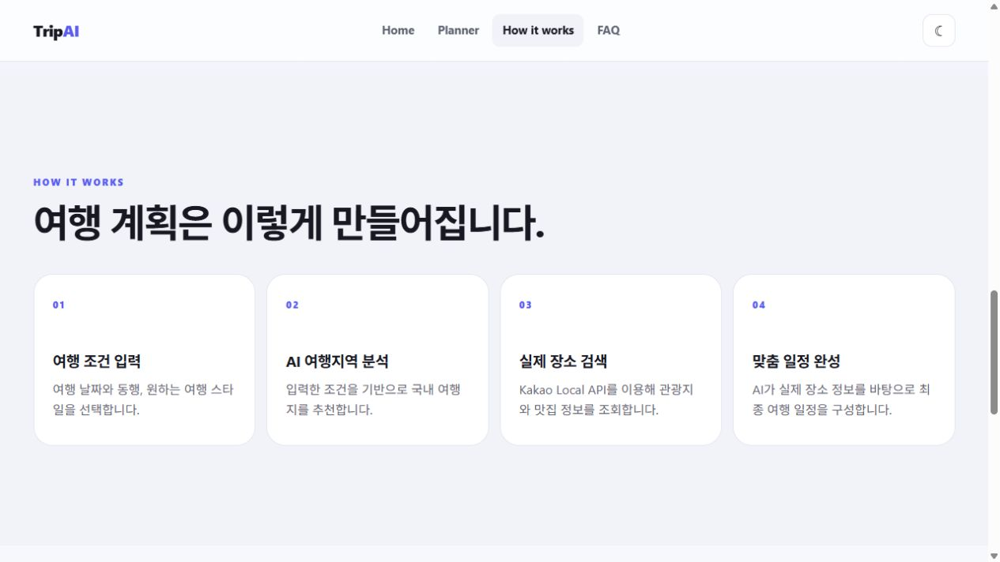

## 5. 서비스 처리 흐름

```text
사용자 입력
  → FastAPI /api/plan 요청
  → AI 1차 분석: 추천 지역·이유·계절 팁 생성
  → Kakao Local API: 실제 관광지·축제 후보·음식점 검색
  → AI 2차 구성: 장소 정보를 바탕으로 최종 하루 일정 생성
  → 프런트엔드 결과 화면 출력
```

### AI 1차 분석

여행 날짜, 동행, 테마를 바탕으로 국내 추천 지역과 추천 이유, 계절 팁을 생성합니다. JSON 형식을 검증하고 형식 오류가 있으면 한 번 재요청합니다.

### 실제 장소 검색

Kakao Local API를 사용해 추천 지역의 관광지와 음식점을 검색합니다. 축제 테마일 때는 축제 후보를 별도로 확인하며, 일부 검색에 실패해도 가능한 결과는 유지하고 경고를 전달합니다.

### AI 2차 일정 구성

확보한 실제 장소 정보를 바탕으로 추천 장소, 맛집, 시간대별 하루 일정을 구성합니다. 응답 형식을 다시 검증하고 재시도 후에도 실패하면 가능한 데이터로 대체 결과를 제공합니다.

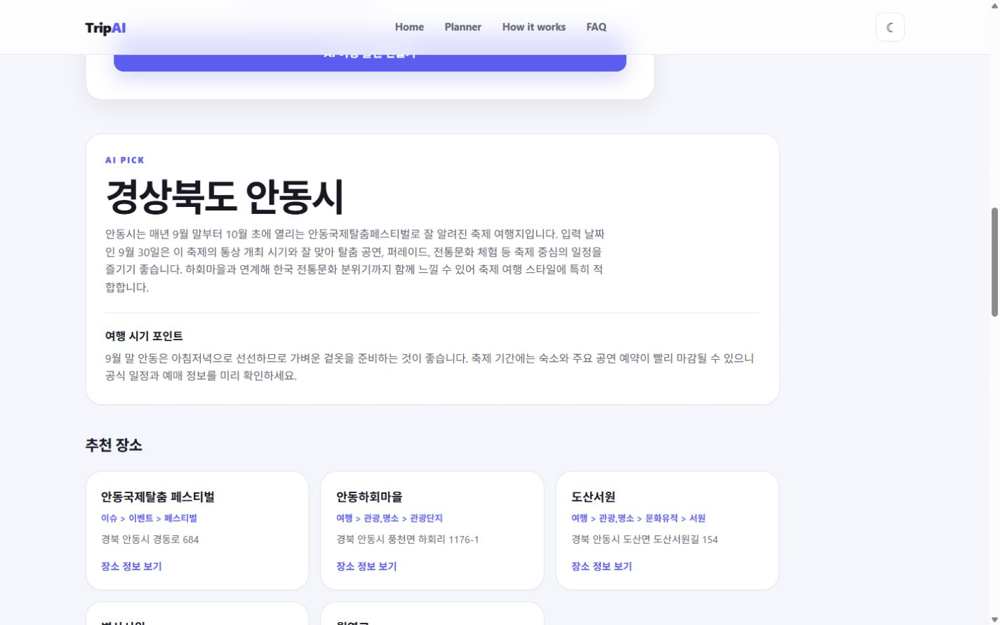

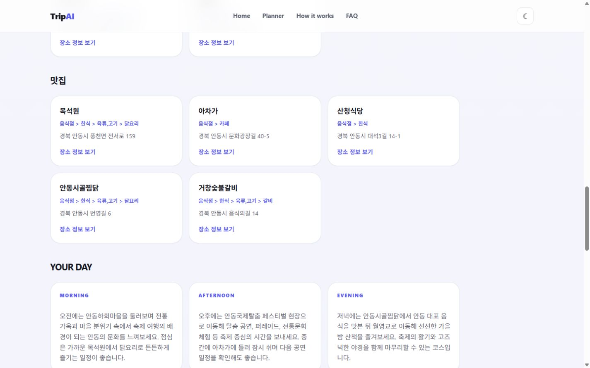

## 6. 주요 기능

- 날짜 유효성 검사 및 필수 입력 안내
- 동행 선택·변경·해제
- 여행 테마 복수 선택
- 축제 테마 검색과 미검색 안내
- AI 추천 지역·이유·계절 팁 표시
- 실제 관광지와 음식점 정보 표시
- 시간대별 하루 일정 구성
- 최대 60초 요청 제한과 단계별 로딩 문구
- 오류 메시지와 부분 결과 경고
- 반응형 모바일 화면 및 모바일 메뉴
- 라이트·다크 테마와 선택 상태 저장

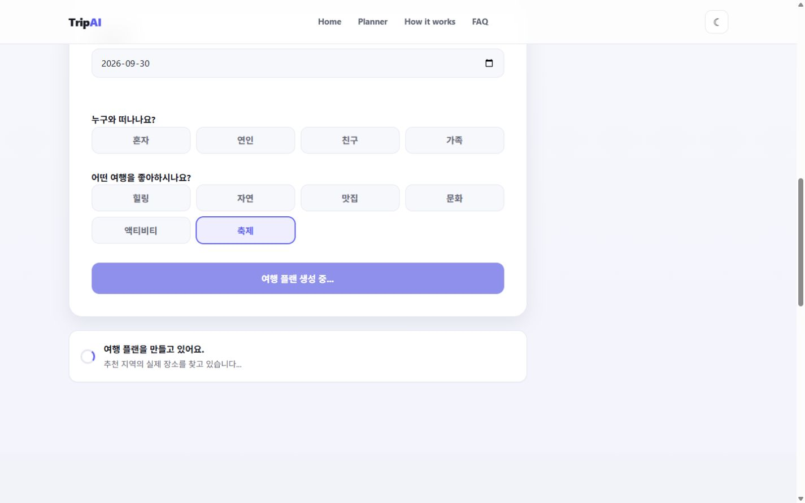

## 7. 기술 구성

| 구분 | 사용 기술 |
|---|---|
| 프런트엔드 | HTML, CSS, Vanilla JavaScript |
| 백엔드 | Python, FastAPI |
| AI | Naito API의 `gpt-5.5` 모델 |
| 장소 검색 | Kakao Local API |
| 배포 | Vercel |

API 키는 프런트엔드에 노출하지 않고 서버 환경 변수로 관리합니다. 입력값의 길이와 허용 범위를 서버에서도 검사하며, 외부 API 응답이 예상 형식인지 확인합니다.

## 8. 반응형·접근성·사용성

모바일에서도 입력 카드와 결과 카드가 한 열로 자연스럽게 배치되며, 메뉴는 모바일 전용 버튼으로 접근할 수 있습니다. 폼은 `fieldset`, `legend`, `label`을 사용하고 선택 상태와 오류 상태를 시각적으로 구분했습니다.

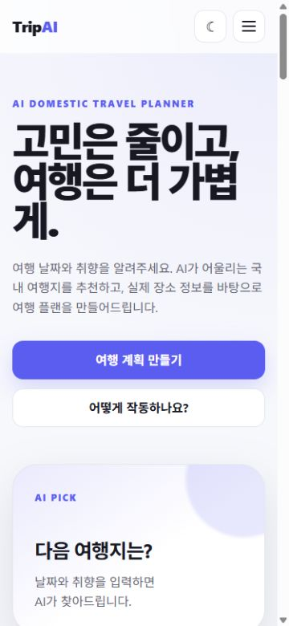

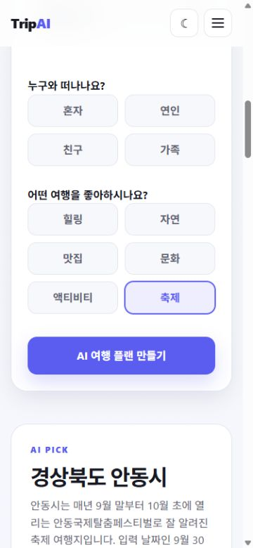

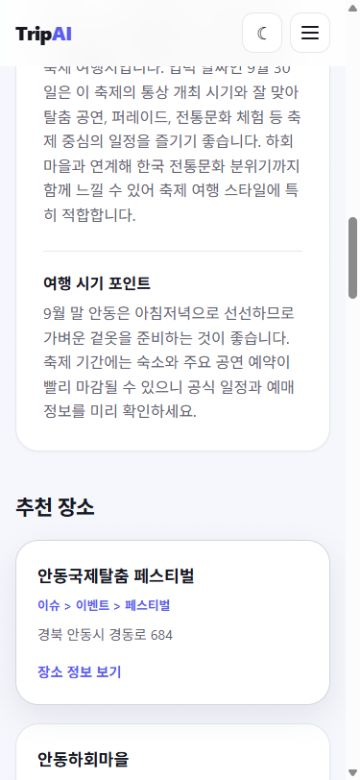

## 9. 구현 과정에서 확인한 한계와 개선 방향

### 9.1 축제 일정의 정확성

현재 축제 후보는 AI 설명과 Kakao 장소 검색 결과를 결합해 확인합니다. 공식 축제 일정 API를 사용하지 않으므로, 특정 날짜의 실제 개최 여부를 공식적으로 보장할 수 없습니다. 향후에는 한국관광공사 행사 API 등 날짜 검증이 가능한 공공 데이터를 연결해야 합니다.

### 9.2 맛집 테마 중복 처리

현재는 축제를 제외한 선택 테마를 일반 장소 검색어로도 사용합니다. 이 때문에 `맛집`을 다른 테마와 함께 선택하면 일반 추천 장소 후보에 음식점이 섞일 가능성이 있습니다. 음식점이 아닌 장소 목록에서는 맛집 요소를 최대한 배제하는 것이 더 적절했습니다.

향후에는 다음과 같이 개선할 수 있습니다.

- `맛집` 테마를 일반 관광지 검색어에서 제외
- 음식점 결과는 맛집 영역에서만 사용
- Kakao 카테고리로 관광지와 음식점을 명확히 분리
- 장소명과 주소를 기준으로 추천 장소·맛집 중복 제거

### 9.3 외부 API 의존성

AI 또는 장소 검색 API가 지연되거나 실패하면 결과 품질이 달라질 수 있습니다. 캐시, 재시도 정책, 공식 데이터 보강을 통해 안정성을 높일 수 있습니다.

## 10. 과제를 통해 학습한 점

- AI 응답은 그대로 출력하기보다 JSON 구조를 검증하고 실패 시 재시도·대체 처리가 필요하다는 점
- 생성형 AI의 설명과 실제 장소 검색 API의 데이터를 역할별로 나누면 신뢰성과 표현력을 함께 확보할 수 있다는 점
- 동일한 `name` 값을 쓰는 폼 요소, 선택 해제 로직 등 작은 입력 설계가 전체 요청 데이터에 직접 영향을 준다는 점
- 축제처럼 날짜 정확성이 중요한 정보는 AI 추론만으로 처리하지 않고 공식 데이터 검증이 필요하다는 점
- 테마 검색어와 결과 카테고리를 분리하지 않으면 맛집이 관광지 목록에 섞이는 등 데이터 중복이 발생할 수 있다는 점
- 로딩, 시간 제한, 오류 안내, 부분 성공 처리가 실제 서비스 사용성에 필수라는 점
- 데스크톱뿐 아니라 모바일에서 입력과 결과를 직접 확인해야 반응형 구현을 검증할 수 있다는 점

## 11. 최종 구현 확인

- 배포 사이트에서 홈, 플래너, 사용 방법, FAQ 확인
- 축제 테마 노출 및 선택 확인
- 날짜 미입력 오류 안내 확인
- AI 추천 결과와 맛집·일정 출력 확인
- 모바일 화면과 다크 모드 확인
- GitHub 최신 확인 커밋: `b27d745ee29249aaf0fc3de7144cb3e64e3d03b9` (`축제수정3`)

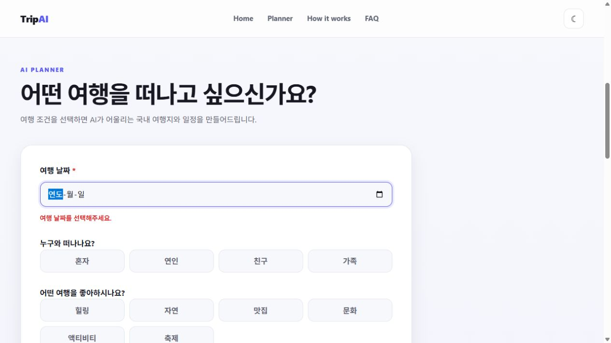

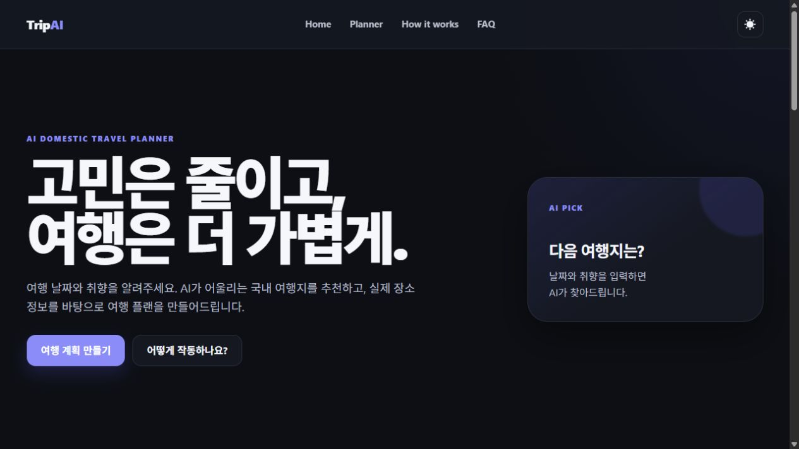

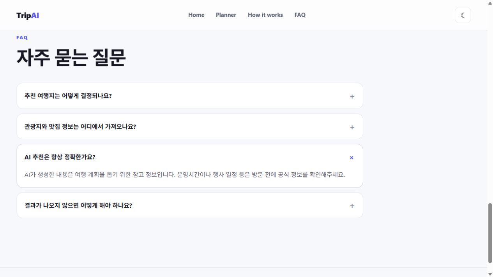
